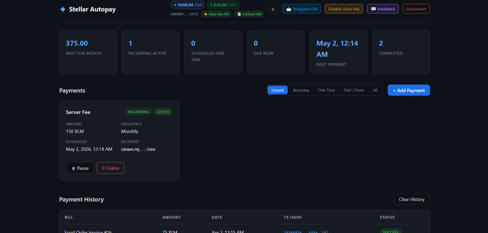

# Stellar Autopay

> Automated recurring & one-time payment system built on the Stellar blockchain.  
> No secret keys. No backend server. Fully on-chain via Soroban smart contracts.

---

## 🔗 Quick Links

|                    |                                                                                                                                                                         |
| ------------------ | ----------------------------------------------------------------------------------------------------------------------------------------------------------------------- |
| **Live Demo**      | [https://stellarautopay.vercel.app](https://stellarautopay.vercel.app)                                                                                                  |
| **Video**          | [https://youtu.be/4C31DK4_cxs](https://youtu.be/4C31DK4_cxs)                                                                                                            |
| **Smart Contract** | [`CC3EMSSEYBKKMELWHKTQV422U2RJJ5FIN5CKBMJF2RPPUHSIGGKMMYUL`](https://stellar.expert/explorer/testnet/contract/CC3EMSSEYBKKMELWHKTQV422U2RJJ5FIN5CKBMJF2RPPUHSIGGKMMYUL) |
| **GitHub**         | [https://github.com/murat48/stellarautopay](https://github.com/murat48/stellarautopay)                                                                                  |
| **Network**        | Stellar Testnet                                                                                                                                                         |
| **Telegram Bot**   | [@StellarAutopay_Bot](https://t.me/StellarAutopay_Bot)                                                                                                                  |
| **Uptime Monitor** | [stats.uptimerobot.com/BT6BibZuWl](https://stats.uptimerobot.com/BT6BibZuWl)                                                                                            |

---

## 🎥 Demo Video

[](https://youtu.be/4C31DK4_cxs)

## 📋 Table of Contents

1. [Overview](#overview)
2. [Features](#features)
3. [Advanced Feature: Multi-Signature Logic](#-advanced-feature-multi-signature-logic)
4. [Smart Contract](#smart-contract)
5. [Data Indexing](#-data-indexing)
6. [Tech Stack](#tech-stack)
7. [Getting Started](#getting-started)
8. [Usage Guide](#usage-guide)
9. [Security Model](#-security-model)
10. [User Guide](#-user-guide)
11. [Project Structure](#project-structure)
12. [Submission Checklist](#-submission-checklist)
13. [User Feedback & Onboarding](#user-feedback--onboarding)
14. [Improvement Plan](#improvement-plan)
15. [Demo Day Presentation](#-demo-day-presentation)

---

## Overview

**Stellar Autopay** is a React single-page application that brings scheduled and automated recurring payments to the Stellar blockchain. Users connect their wallet, define payment rules (amount, recipient, frequency), and let the app execute payments automatically — no manual approval needed for each transaction.

All bill data and payment history live **on-chain** in a Soroban smart contract. There is no backend, no database, and no custody of user funds.

---

## ✨ Features

### 💳 Non-Custodial Wallet Connect

- Supports Freighter, xBull, Lobstr, Albedo via Stellar Wallets Kit
- Secret key never touches the application
- Live XLM and USDC balance display

### 📅 On-Chain Bill Management

- Create recurring (weekly / biweekly / monthly / monthly on specific day / quarterly) and one-time payments
- Supported assets: **XLM** and **USDC**
- Pause, resume, and delete bills at any time
- Default dashboard view shows unpaid bills sorted by due date (soonest first)
- All data stored in the Soroban contract — persists across sessions and devices

### ⚡ Auto-Pay Engine

- One-time wallet signature adds a **session signing key** to the account
- Payment engine polls every 15 seconds; executes any bill that is due
- Checks balance before each payment; skips if insufficient
- Records every attempt on-chain: tx hash, amount, date, status
- Without Auto-Pay: Freighter signs each payment manually (one popup per payment)

### 📊 On-Chain Payment History

- Every payment attempt (success / failed / skipped) stored in the contract
- Direct links to [Stellar Expert](https://stellar.expert/explorer/testnet) for each tx hash

### 🔔 Telegram Notifications

- Scan QR or message [@StellarAutopay_Bot](https://t.me/StellarAutopay_Bot), enter only your Chat ID
- Alerts: 24 hours before payment due, payment success, payment failure

### 📉 Dashboard Metrics

- Paid this month · Active bills · Due now · Next payment · Completed total
  <br>
<br>

### ⚠️ Low Balance Warning

- Banner shown when XLM balance is below upcoming due payments

---

## � Advanced Feature: Multi-Signature Logic

**Category:** Multi-party approval for transactions (Multi-signature Logic)

Stellar Autopay implements a fully on-chain multi-signature approval flow for payments. Before a payment can execute, it must be proposed and approved by a configurable set of co-signers — enforced entirely in the Soroban smart contract.

### How It Works

```
Step 1 — Proposer creates a payment proposal
  propose_payment(proposer, bill_id, [co_signer_1, co_signer_2], threshold)
  → Stored on-chain: approvals=[], status=Pending

Step 2 — Each required co-signer approves independently
  approve_proposal(approver, proposer, proposal_id)
  → On-chain: approvals=[co_signer_1], status=Pending

Step 3 — When approvals ≥ threshold, anyone can execute
  execute_proposal(proposer, proposal_id)
  → On-chain: status=Executed → real XLM/USDC payment sent
```

### Contract Implementation

**Source:** [`contracts/autopay/src/lib.rs`](contracts/autopay/src/lib.rs)

Key functions:

| Function                    | Auth                                        | Description                                                             |
| --------------------------- | ------------------------------------------- | ----------------------------------------------------------------------- |
| `propose_payment`           | Proposer                                    | Creates a multisig proposal for a bill                                  |
| `approve_proposal`          | Co-signer (must be in `required_approvers`) | Adds approval; panics if not authorized                                 |
| `reject_proposal`           | Co-signer                                   | Rejects; auto-marks proposal Rejected if threshold can no longer be met |
| `execute_proposal`          | Anyone                                      | Executes if `approvals.len() >= threshold`; panics otherwise            |
| `get_proposals_as_approver` | None                                        | Returns all pending proposals where address is a required approver      |

Security enforcement in `execute_proposal`:

```rust
if proposal.approvals.len() < proposal.threshold {
    panic!("approval threshold not met");
}
```

No `require_auth()` on execute — security is the on-chain approval count, not the caller identity.

### Live On-Chain Proof

The following complete multisig flow was executed on Stellar Testnet and is permanently recorded on-chain:

**Contract:** [`CC3EMSSEYBKKMELWHKTQV422U2RJJ5FIN5CKBMJF2RPPUHSIGGKMMYUL`](https://stellar.expert/explorer/testnet/contract/CC3EMSSEYBKKMELWHKTQV422U2RJJ5FIN5CKBMJF2RPPUHSIGGKMMYUL)

| Step | Function           | Wallet                         | Timestamp (UTC)     | Details                                             |
| ---- | ------------------ | ------------------------------ | ------------------- | --------------------------------------------------- |
| 1    | `add_bill`         | `GDYA…GK7M`                    | 2026-04-20 20:36:25 | Bill #8 created: 23 XLM one-time payment            |
| 2    | `propose_payment`  | `GDYA…GK7M`                    | 2026-04-20 20:36:25 | Proposal #8, approvers: `[GALD…S7SA]`, threshold: 1 |
| 3    | `approve_proposal` | `GALD…S7SA` ⬅ different wallet | 2026-04-20 20:37:30 | Co-signer approved; approvals: `[GALD…S7SA]`        |
| 4    | `execute_proposal` | `GDYA…GK7M`                    | 2026-04-20 20:44:36 | Threshold met (1/1) → executed                      |
| 5    | `record_payment`   | `GDYA…GK7M`                    | 2026-04-20 20:44:46 | TX: `cdc73de3…3042`, 23 XLM, status: Success        |
| 6    | `mark_paid`        | `GDYA…GK7M`                    | 2026-04-20 20:44:51 | Bill #8 marked Paid                                 |

**Payment TX:** [`cdc73de3cbdffb94755a0e66a13b75c06c1ac2c2f80fe32bde1d638638423042`](https://stellar.expert/explorer/testnet/tx/cdc73de3cbdffb94755a0e66a13b75c06c1ac2c2f80fe32bde1d638638423042)

Note: Steps 2 and 3 were signed by **two separate wallets** (`GDYA…GK7M` as proposer, `GALD…S7SA` as co-signer). The payment in step 5 only succeeded because the co-signer's approval was on-chain before `execute_proposal` was called.

### Frontend Implementation

- **Approvals tab** — co-signers see all proposals requiring their signature (auto-fetched via `get_proposals_as_approver`)
- **Vote History** — co-signers see every proposal they approved/rejected + executed TX link
- **Bill cards** — proposer sees live approval count (e.g. `⏳ 0/2 Approvals` → `⚡ Execute (2/2 ✓)`)
- **+ Add Payment form** — optional multi-sig toggle to create bill + proposal in one action
- **Telegram notifications** — alerts sent on propose, approve, reject, and execute events
- **15-second real-time polling** — all wallets see proposal state updates automatically

---

## 📜 Smart Contract

**Contract ID (current):** [`CC3EMSSEYBKKMELWHKTQV422U2RJJ5FIN5CKBMJF2RPPUHSIGGKMMYUL`](https://stellar.expert/explorer/testnet/contract/CC3EMSSEYBKKMELWHKTQV422U2RJJ5FIN5CKBMJF2RPPUHSIGGKMMYUL)  
**Network:** Stellar Testnet  
**Language:** Rust · Soroban SDK v22  
**Source:** `contracts/autopay/src/lib.rs`  
**Explorer:** [View on Stellar Expert](https://stellar.expert/explorer/testnet/contract/CC3EMSSEYBKKMELWHKTQV422U2RJJ5FIN5CKBMJF2RPPUHSIGGKMMYUL)

> **⚠️ Contract Migration Note**  
> The original contract **`CCGU4EROJG3XVYIRGE5TOYDVUOOCRSPUCSUF4QCHRY3KEBFVLQGS5NIS`** was the initial deployment and does **not** include multi-signature logic.  
> The current contract **`CC3EMSSEYBKKMELWHKTQV422U2RJJ5FIN5CKBMJF2RPPUHSIGGKMMYUL`** was redeployed to add `propose_payment`, `approve_proposal`, `reject_proposal`, `execute_proposal` and the full multisig flow.  
> Wallets that interacted with the old contract (`CCGU4ERO…S5NIS`) will not see their historical data in the current app — all active usage is on the new contract.

### Exported Functions

| Function              | Description                                   | Auth Required |
| --------------------- | --------------------------------------------- | ------------- |
| `add_bill`            | Create a new payment schedule                 | Caller        |
| `pause_bill`          | Toggle pause / resume                         | Caller        |
| `delete_bill`         | Remove a bill permanently                     | Caller        |
| `complete_bill`       | Mark one-time bill as completed               | Caller        |
| `mark_paid`           | Mark bill as paid after on-chain transfer     | Caller        |
| `update_status`       | Update bill status                            | Caller        |
| `update_next_due`     | Advance next due date after recurring payment | Caller        |
| `get_all_bills`       | Fetch all bills for a wallet                  | None          |
| `get_bill`            | Fetch single bill                             | None          |
| `get_active_bills`    | Fetch only active / low-balance bills         | None          |
| `record_payment`      | Write a payment attempt to on-chain history   | Caller        |
| `get_payment_history` | Fetch all payment records for a wallet        | None          |

### Storage Layout

Per-user namespace — no global owner, no initialization required:

```
DataKey::Bill(Address, u64)              → Bill struct
DataKey::BillIds(Address)                → Vec<u64>
DataKey::NextId(Address)                 → u64
DataKey::Payment(Address, u64)           → PaymentRecord struct
DataKey::PaymentIds(Address)             → Vec<u64>
DataKey::PaymentNextId(Address)          → u64
DataKey::ProposalData(Address, u64)      → Proposal struct
DataKey::ProposalIds(Address)            → Vec<u64>
DataKey::ProposalNextId(Address)         → u64
DataKey::ApproverProposals(Address)      → Vec<ProposalRef>  (index for co-signers)
```

### Wallets That Have Used This Contract

Verified on [Stellar Expert (testnet)](https://stellar.expert/explorer/testnet).
Total unique wallets: **7** (collecting 30+ via Google Form)

| #    | Wallet Address                                                                                                                      | Actions                                            |
| ---- | ----------------------------------------------------------------------------------------------------------------------------------- | -------------------------------------------------- |
| 1    | `GC4COEPJQRXZFTRZJYOYEIHVX6OCSZD5GMOAI6JGRDM3Y33VKBLODYUE`                                                                          | add_bill, mark_paid, pause_bill                    |
| 2    | `GCNA5EMJNXZPO57ARVJYQ5SN2DYYPD6ZCCENQ5AQTMVNKN77RDIPMI3A`                                                                          | add_bill, record_payment, update_next_due          |
| 3    | `GALDPLQ62RAX3V7RJE73D3C2F4SKHGCJ3MIYJ4MLU2EAIUXBDSUVS7SA`                                                                          | approve_proposal (co-signer multisig proof)        |
| 4    | `GDBOBVGP6HNLL66IOTSR6COGSZYRTSRDXBUD2CDDN3C5XGUT23TQ54J2`                                                                          | add_bill, record_payment, mark_paid                |
| 5    | `GAJXYRRBECPQVCOCCLBCCZ2KGGNEHL32TLJRT2JWLNVE4HJ35OAKAPH2`                                                                          | add_bill, record_payment, mark_paid                |
| 6    | `GD72JZQAJPGLSLND6GPTSZ64PWMVY3JP5QKQJ32RW2GJCSVOSBPNX2EF`                                                                          | add_bill, record_payment, mark_paid                |
| 7    | `GDYAPFZH5R6EKEQKJ3TKLQPZQASNXSN5IYDPTQ7MBRLZGE5ABGYGK7M`                                                                           | proposer (multisig proof) + add_bill, execute, pay |
| 8–30 | _Collecting via [Google Form](https://docs.google.com/forms/d/e/1FAIpQLSfp4qWFnQUWYiruEyvELlv1RJkK7_Q7UtrEXu4Ze-QmYMtb8A/viewform)_ | Addresses added as users submit feedback           |

### Build & Deploy

```bash
cd contracts/autopay

# Build WASM
stellar contract build

# Run tests
cargo test

# Deploy to testnet
stellar contract deploy \
  --wasm target/wasm32v1-none/release/autopay_contract.wasm \
  --source <YOUR_STELLAR_CLI_ALIAS> \
  --network testnet
```

---

## � Data Indexing

Stellar Autopay uses two data sources for reading and writing blockchain state:

### 1. Stellar Horizon API

**Endpoint:** `https://horizon-testnet.stellar.org`

Used for:

| Operation                                           | Horizon Call                                  | Code Location                  |
| --------------------------------------------------- | --------------------------------------------- | ------------------------------ |
| Load account + sequence number                      | `server.loadAccount(publicKey)`               | `stellar.js`                   |
| Fetch XLM + USDC balances                           | `account.balances`                            | `stellar.js:fetchBalances`     |
| Read existing account signers (session key cleanup) | `account.signers`                             | `stellar.js:buildAddSignerTx`  |
| Submit signed transactions                          | `server.submitTransaction(tx)`                | `stellar.js:submitTx`          |
| Build `setOptions` to add/remove session signer     | `TransactionBuilder` + `Operation.setOptions` | `stellar.js`                   |
| Build payment transactions                          | `Operation.payment`                           | `stellar.js:buildPaymentTxXdr` |

### 2. Soroban RPC

**Endpoint:** `https://soroban-testnet.stellar.org`

Used for all smart contract reads and writes:

| Operation                       | Contract Function                                     | Returns              |
| ------------------------------- | ----------------------------------------------------- | -------------------- |
| Fetch all bills                 | `get_all_bills(address)`                              | `Vec<Bill>`          |
| Fetch payment history           | `get_payment_history(address)`                        | `Vec<PaymentRecord>` |
| Fetch pending proposals (own)   | `get_pending_proposals(address)`                      | `Vec<Proposal>`      |
| Fetch proposals as approver     | `get_proposals_as_approver(address)`                  | `Vec<Proposal>`      |
| Write bill / payment / proposal | `add_bill`, `record_payment`, `propose_payment`, etc. | Struct               |

All contract calls use `simulateTransaction` → `assembleTransaction` → sign → `sendTransaction` → poll pattern via the Soroban RPC JSON-RPC API.

**Explore live contract data:**  
[stellar.expert/explorer/testnet/contract/CC3EMSSEYBKKMELWHKTQV422U2RJJ5FIN5CKBMJF2RPPUHSIGGKMMYUL](https://stellar.expert/explorer/testnet/contract/CC3EMSSEYBKKMELWHKTQV422U2RJJ5FIN5CKBMJF2RPPUHSIGGKMMYUL)

---

## �🛠 Tech Stack

| Layer              | Technology                                         |
| ------------------ | -------------------------------------------------- |
| Frontend           | React 19 + Vite 8                                  |
| Blockchain SDK     | `@stellar/stellar-sdk` v15                         |
| Wallet Integration | `@creit.tech/stellar-wallets-kit` v2               |
| Smart Contract     | Rust + Soroban SDK v22                             |
| Network            | Stellar Testnet (Horizon + Soroban RPC)            |
| Notifications      | Telegram Bot API (direct browser fetch, no server) |
| Hosting            | Vercel                                             |

---

## 🚀 Getting Started

### Prerequisites

- Node.js 18+
- [Freighter Wallet](https://freighter.app/) browser extension
- A funded Stellar **testnet** account → [Friendbot](https://friendbot.stellar.org/?addr=YOUR_KEY)

### Local Setup

```bash
git clone https://github.com/murat48/stellarautopay.git
cd stellarautopay
npm install
npm run dev          # http://localhost:5173
```

### Environment Variables

Create a `.env` file:

```
VITE_TELEGRAM_BOT_TOKEN=your_telegram_bot_token
```

### Production Build

```bash
npm run build        # outputs to dist/
vercel deploy --prod # or push to GitHub for auto-deploy
```

---

## 📖 Usage Guide

1. **Connect Wallet** — Click Connect Wallet, choose Freighter (recommended for testnet), approve.
2. **Add a Payment** — Click `+ Add Payment`, fill in recipient address, amount (XLM or USDC), frequency, and scheduled date.
3. **Enable Auto-Pay** — Click ⚡ Enable Auto-Pay → sign one `setOptions` tx → all future payments are automatic.
4. **Monitor** — Dashboard shows unpaid bills sorted by due date. Metrics strip shows key numbers.
5. **Telegram Alerts** — Click 📨 Telegram, scan QR or search @StellarAutopay_Bot, paste your Chat ID, Test, Save.
6. **Disable Auto-Pay** — Click ⚡ Auto-Pay ON → Disable → removes session signer from your account.

---

## 🔒 Security Model

### Application Security (OWASP Top 10)

| OWASP Category                | Relevant Risk                | Mitigation in Stellar Autopay                                                                        |
| ----------------------------- | ---------------------------- | ---------------------------------------------------------------------------------------------------- |
| A01 Broken Access Control     | Unauthorised contract writes | `caller.require_auth()` on every state-changing contract function                                    |
| A02 Cryptographic Failures    | Private key exposure         | Keys never leave browser extension (Freighter / Wallets Kit); session key lives only in `useRef` RAM |
| A03 Injection                 | XSS via user input           | React DOM escaping; no `dangerouslySetInnerHTML`; all user strings rendered as text nodes            |
| A04 Insecure Design           | Replay / double payment      | In-memory `paidBillsRef` + localStorage deduplication key per bill+cycle                             |
| A05 Security Misconfiguration | Exposed secrets              | `VITE_TELEGRAM_BOT_TOKEN` in `.env`; `.gitignore` prevents commit; no other secrets                  |
| A06 Vulnerable Components     | Supply chain risk            | Monthly `npm audit`; locked `package-lock.json`; pinned Soroban SDK v22                              |
| A07 Auth Failures             | Session key abuse            | Weight = 1 only; Stellar threshold unchanged; removed on disable/disconnect atomically               |
| A08 Software Integrity        | Tampered WASM                | WASM deployed via Stellar CLI; immutable on-chain after deployment                                   |
| A09 Logging Failures          | Silent errors                | Structured `logger.js` (levels: debug/info/warn/error); ring-buffer in localStorage; downloadable    |
| A10 SSRF                      | External API abuse           | Only calls official Stellar Horizon + Soroban RPC endpoints; no user-controlled URLs                 |

### Stellar-Specific Security

| Risk                           | Mitigation                                                                    |
| ------------------------------ | ----------------------------------------------------------------------------- |
| Session key max lifetime       | Auto-revoked on wallet disconnect or auto-pay disable                         |
| Session key weight             | Always `weight=1`; cannot sign alone if master key weight > 1                 |
| Multisig threshold enforcement | Contract panics if `approvals.len() < threshold`; cannot bypass in any caller |
| Duplicate co-signer approval   | `approve_proposal` panics if address already in `approvals` vec               |
| Orphaned session signers       | Detected via `account.signers` on each enable; removed in same tx             |
| RPC error handling             | All contract calls use simulate → assemble → sign → submit → poll pattern     |

---

## 📖 User Guide

### 1. Connect Your Wallet

1. Open [stellarautopay.vercel.app](https://stellarautopay.vercel.app)
2. Click **Connect Wallet** and choose your wallet (Freighter recommended for testnet)
3. Approve the connection in the wallet popup
4. Your XLM and USDC balances appear at the top

> **Need testnet funds?** Fund any address at [friendbot.stellar.org](https://friendbot.stellar.org)

### 2. Add a Payment

1. Click **+ Add Payment**
2. Fill in:
   - **Name** — a label for the bill (e.g. "Monthly Rent")
   - **Recipient** — Stellar public key (G...)
   - **Amount** — number in XLM or USDC
   - **Asset** — XLM or USDC
   - **Type** — One-Time or Recurring
   - **Due Date / Time** — when to execute
   - For recurring: choose frequency (Weekly / Monthly / etc.)
3. Optional: tick **🔐 Require multi-sig approval** to add co-signer addresses and a threshold
4. Click **Add Payment**

### 3. Enable Auto-Pay

1. Click **⚡ Enable Auto-Pay** in the top bar
2. Approve the `setOptions` transaction in Freighter (one-time)
3. The engine now polls every 15 seconds and pays any bill that is due automatically
4. To stop: click **⚡ Auto-Pay ON → Disable** — the session key is removed from your account

### 4. Multi-Signature Payments

1. When adding a bill, enable **🔐 Require multi-sig** and add co-signer wallet addresses
2. The bill is created and a proposal is opened on-chain in one step
3. Co-signers open the app with their own wallet, go to **Approvals** tab, and approve
4. Once the threshold is met, the proposer's **Execute** button becomes active
5. After execution, payment is sent and the bill is marked Paid

### 5. Telegram Notifications

1. Click **📨 Telegram** in the top bar
2. Scan the QR code or search **@StellarAutopay_Bot** in Telegram
3. Send `/start` to the bot and copy the Chat ID it returns
4. Paste it into the Chat ID field, click **Test**, then **Save**
5. You will now receive alerts 24h before due, on success, and on failure

### 6. View History

- Click the **History** tab to see all on-chain payment records
- Each entry has a link to [Stellar Expert](https://stellar.expert/explorer/testnet)

### 7. Metrics & Analytics

The metrics strip at the top of the dashboard shows:

- **Paid This Month** · **Recurring Active** · **Scheduled One-Time** · **Due Now** · **Next Payment** · **Completed**
- **Active Days** — how many days this wallet has been active
- **Retention** — days between first and last login
- **TX Success Rate** — % of successful on-chain payments

---

## 📁 Project Structure

```
stellarautopay/
├── contracts/autopay/src/lib.rs     # Soroban smart contract (Rust)
├── src/
│   ├── utils/
│   │   ├── stellar.js               # Horizon payment builder / signer
│   │   ├── contractClient.js        # Direct Soroban RPC client
│   │   └── logger.js                # Structured logger (levels + localStorage buffer)
│   ├── hooks/
│   │   ├── useWallet.js             # Wallet connect + session key management
│   │   ├── useBills.js              # Bill CRUD (Soroban contract)
│   │   ├── usePaymentEngine.js      # 15s auto-payment polling loop
│   │   ├── usePaymentHistory.js     # On-chain payment history
│   │   ├── useMultisig.js           # Proposal create / approve / reject / execute
│   │   ├── useApprovalHistory.js    # Co-signer vote history (localStorage)
│   │   ├── useAnalytics.js          # DAU, retention, TX success rate
│   │   └── useTelegram.js           # Telegram Bot API notifications
│   ├── components/
│   │   ├── WalletConnect.jsx        # Login screen
│   │   ├── BillDashboard.jsx        # Bill cards + filter tabs
│   │   ├── AddBillForm.jsx          # Schedule payment modal (with multisig toggle)
│   │   ├── ApprovalsTab.jsx         # Co-signer pending proposals + vote history
│   │   ├── MultisigModal.jsx        # Proposal details + approve/reject/execute
│   │   ├── PaymentHistory.jsx       # History table with tx links
│   │   ├── MetricsStrip.jsx         # Summary numbers + analytics bar
│   │   ├── LowBalanceWarning.jsx    # Balance warning banner
│   │   ├── TelegramSettings.jsx     # Telegram config modal
│   │   └── FeedbackForm.jsx         # Embedded Google Form
│   ├── App.jsx / App.css
│   └── main.jsx
├── vercel.json
└── package.json
```

---

## ✅ Submission Checklist

| Requirement                                     | Status        | Link / Proof                                                                                                                |
| ----------------------------------------------- | ------------- | --------------------------------------------------------------------------------------------------------------------------- |
| Public GitHub repository                        | ✅            | [github.com/murat48/stellarautopay](https://github.com/murat48/stellarautopay)                                              |
| Live demo deployed                              | ✅            | [stellarautopay.vercel.app](https://stellarautopay.vercel.app)                                                              |
| README with complete documentation              | ✅            | This file                                                                                                                   |
| Minimum 15+ meaningful commits                  | ✅ 37 commits | `git log --oneline`                                                                                                         |
| Advanced feature: Multi-signature Logic         | ✅            | [Section above](#-advanced-feature-multi-signature-logic)                                                                   |
| Advanced feature proof (on-chain TX)            | ✅            | [TX cdc73de3…](https://stellar.expert/explorer/testnet/tx/cdc73de3cbdffb94755a0e66a13b75c06c1ac2c2f80fe32bde1d638638423042) |
| Smart contract deployed                         | ✅            | [CC3EMSSE…MMYUL](https://stellar.expert/explorer/testnet/contract/CC3EMSSEYBKKMELWHKTQV422U2RJJ5FIN5CKBMJF2RPPUHSIGGKMMYUL) |
| Data indexing (Horizon + Soroban RPC)           | ✅            | [Section above](#-data-indexing)                                                                                            |
| Security checklist                              | ✅            | [Security Model](#-security-model)                                                                                          |
| User guide (in-app + README)                    | ✅            | [User Guide section](#-user-guide)                                                                                          |
| User metrics tracking (DAU, retention, TX rate) | ✅            | `useAnalytics.js` + MetricsStrip                                                                                            |
| Production logging                              | ✅            | `logger.js` (levels + localStorage + download)                                                                              |
| Metrics dashboard                               | ✅            | Built-in MetricsStrip in app                                                                                                |
| 30+ user wallet addresses                       | ⏳            | Collecting via Google Form                                                                                                  |
| Monitoring dashboard                            | ✅            | [stats.uptimerobot.com/BT6BibZuWl](https://stats.uptimerobot.com/BT6BibZuWl)                                                |
| Community contribution (Twitter/X post)         | ⏳            | Post pending                                                                                                                |
| Google Form for user onboarding                 | ✅            | [Open Form](https://docs.google.com/forms/d/e/1FAIpQLSfp4qWFnQUWYiruEyvELlv1RJkK7_Q7UtrEXu4Ze-QmYMtb8A/viewform)            |
| Exported user responses (Excel/Sheets)          | ✅            | [📥 Download user-feedback.xlsx](docs/user-feedback.xlsx) · [View Form Analytics](https://docs.google.com/forms/d/e/1FAIpQLSfp4qWFnQUWYiruEyvELlv1RJkK7_Q7UtrEXu4Ze-QmYMtb8A/viewanalytics) |
| Improvement plan with commit links              | ✅            | [Section below](#improvement-plan)                                                                                          |

---

## 💬 User Feedback & Onboarding

### Google Form

Users submit feedback via the **💬 Feedback** button in the app or directly via the link below.  
The form collects five fields that feed the improvement roadmap:

**→ [Open Feedback Form](https://docs.google.com/forms/d/e/1FAIpQLSfp4qWFnQUWYiruEyvELlv1RJkK7_Q7UtrEXu4Ze-QmYMtb8A/viewform)**

| # | Field | Type |
|---|-------|------|
| 1 | Full Name | Short answer |
| 2 | Email Address | Short answer (email) |
| 3 | Stellar Testnet Wallet Address | Short answer (G…) |
| 4 | Product Rating | Linear scale 1 – 5 ★ |
| 5 | Comments / Suggestions | Paragraph (optional) |

### How Data Flows — Step by Step

```
1. User fills the Google Form (link above)
        ↓  (automatic — Google handles this)
2. Response lands instantly in Google Sheets
        ↓  (manual export by maintainer)
3. Google Sheets → File → Download → Microsoft Excel (.xlsx)
        ↓
4. Replace  docs/user-feedback.xlsx  and commit to GitHub
        ↓
5. README wallet table (rows 8–30+) updated with new addresses
```

> Google Forms → Sheets sync is **fully automatic**. The maintainer only needs to perform steps 3–5 after each batch of new submissions.

### View Responses & Analytics

| Resource | Link |
|----------|------|
| Live form analytics | [View Form Analytics](https://docs.google.com/forms/d/e/1FAIpQLSfp4qWFnQUWYiruEyvELlv1RJkK7_Q7UtrEXu4Ze-QmYMtb8A/viewanalytics) |
| Exported Excel file | [📥 docs/user-feedback.xlsx](docs/user-feedback.xlsx) |

### Exported Excel File

**→ [📥 docs/user-feedback.xlsx](docs/user-feedback.xlsx)**

The workbook contains two sheets:

| Sheet | Contents |
|-------|----------|
| **User Feedback** | One row per respondent — Full Name, Email, Stellar Wallet Address, Product Rating (1–5 ★), Comments, Submission Date |
| **Summary** | Aggregate stats (total responses, average rating), all external links, data-collection process guide |

> **Current status:** 7 wallet addresses collected from on-chain activity. Rows 8–30+ will be populated as users submit the Google Form. The file is re-exported from Google Sheets after each batch of new submissions and committed to this repository.

---

## 🔄 Improvement Plan

### Iteration 1 — Completed (based on early tester feedback)

| #   | Problem Reported                                               | Fix Applied                                                                          | Commit                                                              |
| --- | -------------------------------------------------------------- | ------------------------------------------------------------------------------------ | ------------------------------------------------------------------- |
| 1   | `mark_paid` and `record_payment` not firing in manual mode     | Added `externalSignFn` parameter so contract writes work without auto-pay            | [55d36b7](https://github.com/murat48/stellarautopay/commit/55d36b7) |
| 2   | Auto-pay failing with HTTP 400 error                           | Improved error extraction from Horizon `result_codes`; added readable error messages | [fff4287](https://github.com/murat48/stellarautopay/commit/fff4287) |
| 3   | `op_too_many_signers` when enabling auto-pay                   | Orphaned session keys are now removed atomically in the same transaction             | [65e5c14](https://github.com/murat48/stellarautopay/commit/65e5c14) |
| 4   | Fees too high (1M stroops per contract call)                   | Reduced Soroban fee to 300K, classic tx fee to 1K stroops                            | [bc024a9](https://github.com/murat48/stellarautopay/commit/bc024a9) |
| 5   | Multiple Freighter popups for a single payment                 | Eliminated repeated popups in manual mode — one popup per payment                    | [bc024a9](https://github.com/murat48/stellarautopay/commit/bc024a9) |
| 6   | Telegram test button silently did nothing before saving        | `testConnection` now bypasses `enabled` check, sends directly with provided Chat ID  | [9d872e9](https://github.com/murat48/stellarautopay/commit/9d872e9) |
| 7   | Dashboard showed all bills by default, hard to find unpaid     | Default filter changed to "Unpaid", sorted soonest-due first                         | [414a760](https://github.com/murat48/stellarautopay/commit/414a760) |
| 8   | Completed count showed 0 despite paid bills existing           | Fixed metrics to count both `completed` and `paid` statuses                          | [31f2e21](https://github.com/murat48/stellarautopay/commit/31f2e21) |
| 9   | Telegram instructions in Turkish, hard for international users | Full English UI + QR code for @StellarAutopay_Bot added                              | [31f2e21](https://github.com/murat48/stellarautopay/commit/31f2e21) |
| 10  | Old contract had stale data from development                   | Redeployed fresh contract to testnet                                                 | [414a760](https://github.com/murat48/stellarautopay/commit/414a760) |
| 11  | Initial contract (`CCGU4ERO…S5NIS`) lacked multi-sig support   | Migrated to new contract (`CC3EMSSE…MMYUL`) with full `propose/approve/execute` flow | [414a760](https://github.com/murat48/stellarautopay/commit/414a760) |
| 12  | Payment engine could race against ongoing auto-pay setup       | Added `autoPayLoading` guard to block engine during `setOptions` transaction          | [351789a](https://github.com/murat48/stellarautopay/commit/351789a) |
| 13  | ApprovalsTab mixed voted and unvoted proposals causing confusion | Pending tab now excludes already-voted proposals; separate Approved sub-tab          | [a9fd737](https://github.com/murat48/stellarautopay/commit/a9fd737) |
| 14  | Analytics metrics buried inside dashboard, hard to find        | Moved to dedicated Analytics tab in dashboard navigation                              | [238fc6e](https://github.com/murat48/stellarautopay/commit/238fc6e) |

### Next Phase — Planned Improvements

The improvements below are driven by patterns in the Google Form feedback (ratings, comments, and wallet activity observed on-chain). Each item will have a corresponding commit linked once implemented.

| Priority | Feature | Feedback Signal | Status |
|----------|---------|----------------|--------|
| 🔴 High | **Mainnet support** — toggle between Testnet and Mainnet with risk warnings | Users with real funds cannot test production payments | Planned |
| 🔴 High | **Mobile layout** — responsive design optimized for phones; Freighter mobile support | Several respondents noted the UI breaks on mobile browsers | Planned |
| 🟡 Medium | **CSV / Excel payment history export** — download on-chain payment records for personal accounting | Requested in comments: "need to export for taxes" | Planned |
| 🟡 Medium | **Offline notifications via Service Worker** — push alerts even when the browser tab is closed | Users expect alerts without keeping the tab open 24/7 | Planned |
| 🟡 Medium | **Bill categories & tags** — label bills (rent, utilities, subscriptions) and filter by category | Dashboard becomes cluttered when users have 10+ bills | Planned |
| 🟢 Low | **Recurring bill end date** — set an expiry so a bill auto-stops after N payments | Subscription-style payments need a natural end | Planned |
| 🟢 Low | **Multi-asset support (EURC, USDC bridged)** — extend beyond XLM and USDC | Users asked about other Stellar assets | Planned |

> Commit links will be added to the table above as each feature is implemented. The Google Form continues to collect new feedback; the Excel export in `docs/user-feedback.xlsx` is updated after each batch.

---

---

## 🎤 Demo Day Presentation

### Elevator Pitch (30 seconds)

> "Stellar Autopay is a fully on-chain recurring payment system on Stellar. No backend, no custody. Connect your wallet, schedule a bill, enable auto-pay — and it executes automatically every 15 seconds. It also supports multi-signature approval flows where multiple co-signers must approve a payment before it can execute, all enforced in a Soroban smart contract."

### Live Demo Script

| Step | Action                                                              | What to show                                                                               |
| ---- | ------------------------------------------------------------------- | ------------------------------------------------------------------------------------------ |
| 1    | Open [stellarautopay.vercel.app](https://stellarautopay.vercel.app) | Landing / connect screen                                                                   |
| 2    | Connect Freighter wallet                                            | Balance display: XLM + USDC                                                                |
| 3    | Add a one-time bill                                                 | Form with recipient, amount, due time                                                      |
| 4    | Show bill card in dashboard                                         | Due date, amount, Active badge                                                             |
| 5    | Enable Auto-Pay                                                     | Freighter popup → session key added                                                        |
| 6    | Wait 15 seconds                                                     | Bill executes automatically                                                                |
| 7    | Show payment history                                                | TX hash + Stellar Expert link                                                              |
| 8    | Show Telegram alert                                                 | Phone notification                                                                         |
| 9    | Add multisig bill                                                   | Enable 🔐 toggle, add co-signer                                                            |
| 10   | Switch to co-signer wallet                                          | Approvals tab — pending proposal visible                                                   |
| 11   | Approve proposal                                                    | Co-signer signs on-chain                                                                   |
| 12   | Execute proposal                                                    | Proposer clicks Execute — payment sent                                                     |
| 13   | Show MetricsStrip                                                   | Active Days · Retention · TX Success Rate                                                  |
| 14   | Show UptimeRobot                                                    | [stats.uptimerobot.com/BT6BibZuWl](https://stats.uptimerobot.com/BT6BibZuWl) — 100% uptime |

### Key Technical Points for Q&A

- **No backend** — all state in Soroban persistent storage, per-wallet namespace
- **Session key** — Stellar native `setOptions` weight=1; removed atomically on disable
- **Multisig security** — contract panics if threshold not met; co-signer list stored on-chain
- **Data sources** — Horizon API for account/balances/payments; Soroban RPC for contract state
- **Structured logging** — `logger.js` with ring-buffer, downloadable for support
- **Analytics** — `useAnalytics.js` tracks active days, retention, TX success rate in localStorage
- **37 commits** — full development history on GitHub

---

## 📄 License

MIT License

---

## 🙏 Acknowledgements

- [Stellar Development Foundation](https://stellar.org) — Horizon API & Soroban smart contracts
- [Creit Tech](https://github.com/Creit-Tech/Stellar-Wallets-Kit) — Stellar Wallets Kit
- [Stellar Expert](https://stellar.expert) — Testnet transaction explorer
